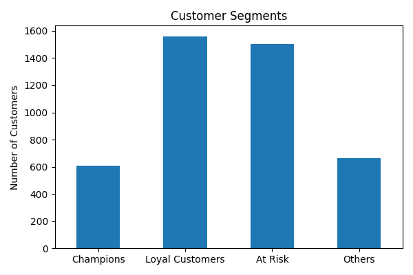
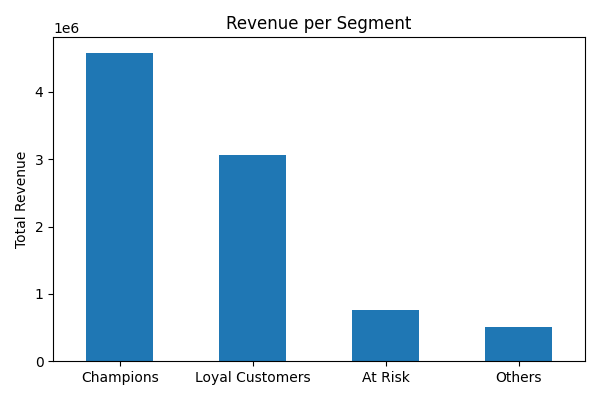
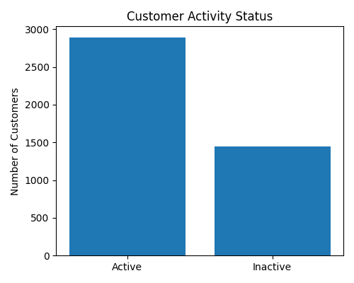
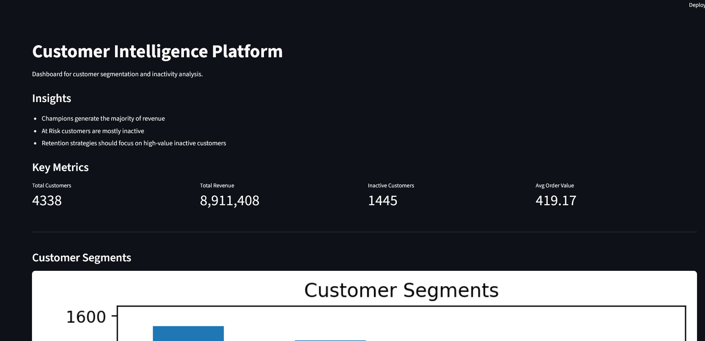

# Customer Intelligence Platform

## Project Overview

This project analyzes transactional e-commerce data to better understand
customer behavior and support retention decisions.

The main goal is to identify: - high-value customers
- customers at risk of becoming inactive
- opportunities to improve customer retention

The project follows a workflow, from raw data to
business insights and an interactive dashboard.

------------------------------------------------------------------------

## Business Problem

Companies often struggle to understand which customers generate the most
value and which customers are at risk of becoming inactive. Without this
insight, it is difficult to prioritize retention strategies and allocate
resources effectively.

This project aims to solve that problem by segmenting customers based on
their behavior and identifying high-risk groups.

------------------------------------------------------------------------

## Solution

A customer intelligence pipeline was built using Python to:

-   Clean and preprocess transactional data
-   Engineer customer-level features
-   Segment customers into meaningful groups
-   Identify inactive customers
-   Visualize insights through an interactive dashboard

------------------------------------------------------------------------

## Dataset

The project uses the Online Retail dataset, which contains
transaction-level data from an e-commerce platform.

Each row represents a product within an order and includes: -
CustomerID
- InvoiceNo
- InvoiceDate
- Quantity
- UnitPrice
- Country

From this data, customer-level features were created such as:

-   Total revenue
-   Number of orders
-   Recency (days since last purchase)
-   Average order value

------------------------------------------------------------------------
## Project Structure

```
customer_intelligence_platform/
│
├── app/
│   └── streamlit_app.py
│
├── data/
│   ├── raw/
│   │   └── Online Retail.xlsx
│   └── processed/
│       └── customer_features.csv
│
├── notebooks/
│   └── customer_intelligence_full_notebook.ipynb
│
├── outputs/
│   └── figures/
│       ├── dashboard.png
│       ├── inactive_vs_active.png
│       ├── revenue_per_segment.png
│       └── segment_distribution.png
│
├── README.md
├── requirements.txt
└── .gitignore
```

------------------------------------------------------------------------

## Methodology

### Data Cleaning

-   Removed missing CustomerIDs
-   Removed returns (negative quantities)
-   Filtered invalid prices
-   Created revenue column

### Feature Engineering

-   total_orders
-   total_revenue
-   recency
-   average order value

### Segmentation (RFM)

-   Champions → high value, recent
-   Loyal Customers → frequent buyers
-   At Risk → declining activity
-   Others → remaining customers

### Inactivity Definition

recency \> 90 days

### Predictive Modeling

-   Logistic Regression
-   ROC-AUC ≈ 0.77
-   Removed recency to prevent leakage

------------------------------------------------------------------------

## Key Insights

-   Champions generate the majority of revenue
-   Many customers are inactive → retention problem
-   At Risk segment contains high-value opportunities
-   Retention should focus on high-value inactive users

------------------------------------------------------------------------

## Visualizations

### Customer Segments



### Revenue per Segment



### Customer Activity



------------------------------------------------------------------------

## Dashboard

An interactive dashboard was built using Streamlit to explore customer
behavior.

Features:

-   KPI overview
-   Segment distribution
-   Revenue breakdown
-   Interactive filtering



------------------------------------------------------------------------

## How to Run

1.  Clone the repository

2.  Install dependencies:

pip install -r requirements.txt

3.  Run the app:

streamlit run app/streamlit_app.py

------------------------------------------------------------------------

## Tech Stack

-   Python
-   Pandas
-   Matplotlib
-   Scikit-learn
-   Streamlit

------------------------------------------------------------------------

## Author

Luke Rodermond
Data Science & Society
Tilburg University
